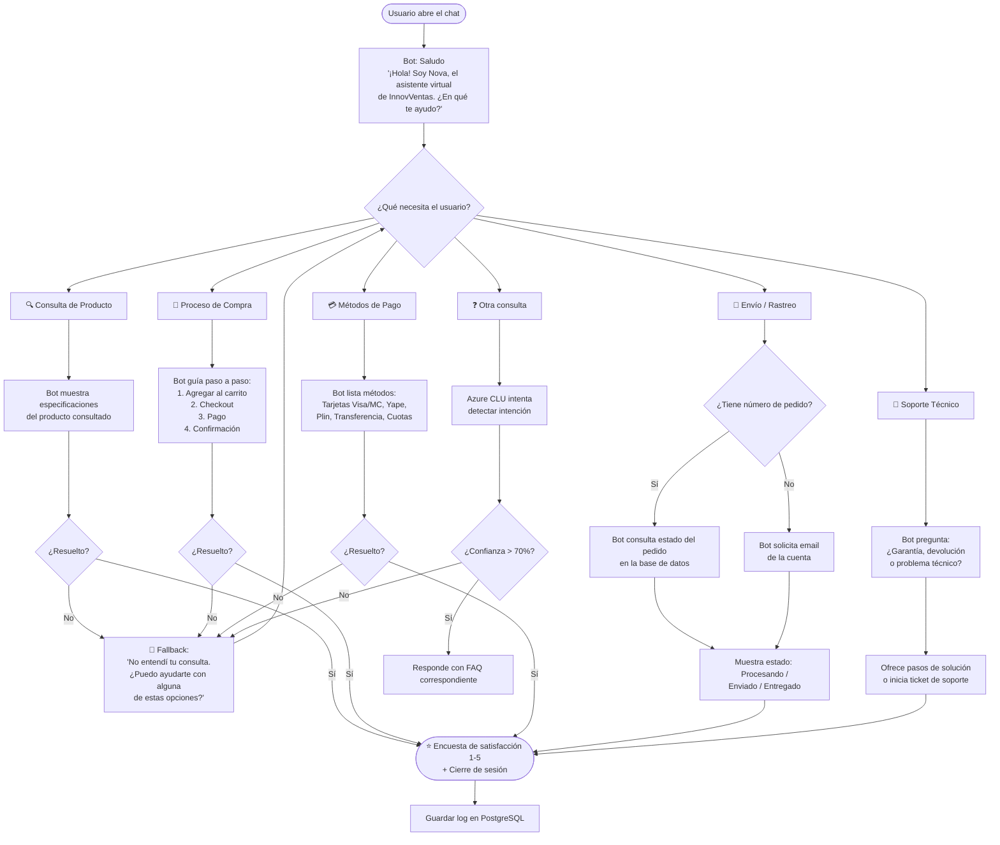
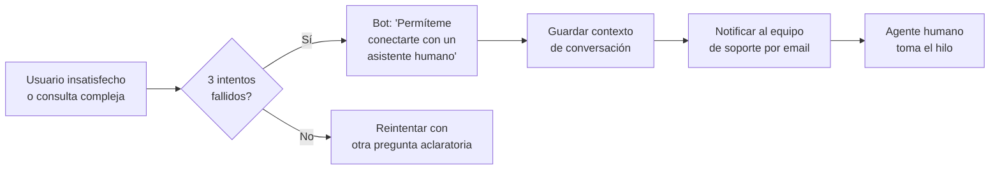

# Diagrama de Flujo Conversacional — Chatbot InnovVentas
## Mapa Conversacional del Chatbot

---

## Flujo Principal (Mermaid)



---

## Flujo de Escalado a Agente Humano



---

## Intenciones del Bot (Intents)

| Intent | Ejemplos de Utterances | Respuesta |
|--------|----------------------|-----------|
| `saludo` | "hola", "buenas", "hey" | Saludo + menú principal |
| `consulta_producto` | "¿qué procesador tiene el laptop X?", "especificaciones del celular Y" | Info del producto desde BD |
| `disponibilidad` | "¿tienen stock?", "¿está disponible?" | Consultar inventario |
| `precio` | "¿cuánto cuesta?", "precio del monitor Z" | Precio actual |
| `metodo_pago` | "¿aceptan Yape?", "¿pago con tarjeta?" | Lista de métodos de pago |
| `proceso_compra` | "¿cómo compro?", "no sé cómo pagar" | Guía paso a paso |
| `cuotas` | "¿hay financiamiento?", "¿pago en cuotas?" | Info de financiamiento |
| `envio_tiempo` | "¿cuánto demora el envío?", "¿llegan a provincia?" | Tiempos y costos |
| `rastreo_pedido` | "¿dónde está mi pedido?", "quiero rastrear mi compra" | Estado del pedido |
| `garantia` | "¿qué garantía tiene?", "mi producto falló" | Info de garantía + soporte |
| `devolucion` | "quiero devolver un producto", "no me llegó bien" | Política de devoluciones |
| `contacto` | "quiero hablar con un agente", "teléfono de contacto" | Datos de contacto |
| `despedida` | "gracias", "hasta luego", "adiós" | Despedida + encuesta CSAT |
| `fallback` | Cualquier consulta no reconocida | Menú de opciones + opción de escalar |

---

## Estados de la Conversación

```
INICIO → IDENTIFICANDO_INTENCION → RESPONDIENDO → [RESOLVIENDO | ESCALANDO] → CERRANDO → FIN
```

### Detalle de Estados
- **INICIO:** saludo automático del bot
- **IDENTIFICANDO_INTENCION:** Azure CLU procesa el mensaje
- **RESPONDIENDO:** bot entrega respuesta de la FAQ o consulta la BD
- **RESOLVIENDO:** intercambio de mensajes hasta resolver la duda
- **ESCALANDO:** 3 fallbacks consecutivos → derivar a humano
- **CERRANDO:** encuesta CSAT + guardar log
- **FIN:** sesión cerrada en PostgreSQL
